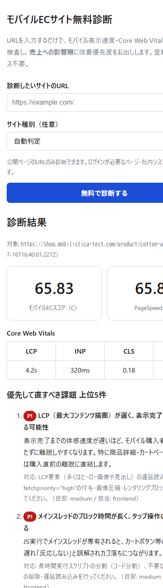
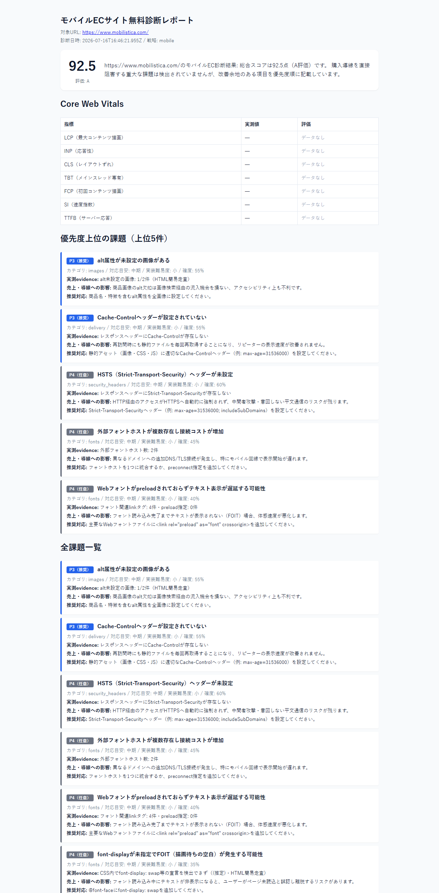
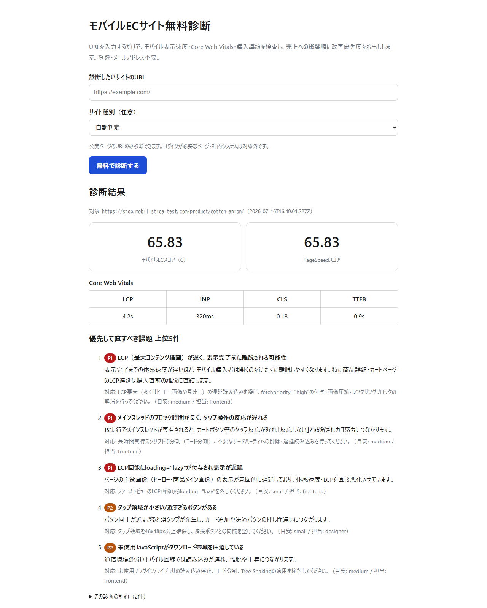

# Mobilistica Mobile Commerce Audit

[](https://github.com/MASUTO1124/mobilistica-mobile-commerce-audit/actions/workflows/test.yml)
[](LICENSE)


**ECサイト向けの無料・オープンソースなモバイルコマース診断ツール。PageSpeed/Core Web Vitalsの技術指標を、優先順位付き＋売上影響の言葉に翻訳します。**

English README: [README.md](README.md)

URLを入力すると、単なる技術スコアではなく「今どこから直すべきか」を優先順位付きで返します。**Web診断UI・CLI・Claude Codeスキル**の3形態を、すべて同じ診断コア（`src/mobilistica_audit/`）から提供しているため、形態ごとに結果がズレることはありません。

---

## できること

一般的なPageSpeed診断ツールは「LCPが4.2秒です」としか教えてくれません。それが商品詳細ページの、しかもカートに入れるボタンの直前で起きていて、モバイル購入を取りこぼしている可能性が高いことまでは教えてくれません。Mobilistica Mobile Commerce Auditは以下を行います。

- モバイル中心の技術診断（表示速度・画像・JS/CSS・フォント・配信・モバイルUX・購入導線UX・技術SEO・セキュリティヘッダー・サードパーティスクリプト）を実行
- ページ種別（商品一覧・商品詳細・カート・チェックアウト・記事など）とプラットフォーム（WordPress/WooCommerce・Shopify・その他）を判定
- すべての指摘を7軸（売上影響・モバイルUX影響・SEO影響・CWV影響・難易度・コスト・確信度）でスコアリングし、**P0〜P4の優先順位**を導出。何から直すべきかが分かります
- 各指摘を、生の診断ルール名ではなく**売上影響の言葉（日本語）＋具体的な修正案**に翻訳
- APIキーが無くても停止しません（低クォータでフォールバック動作）。対象サイトと（任意で）Google PageSpeed Insights以外の外部通信は不要です

このツールは**順位や売上を保証するものではありません**。詳細は下記「[制限事項](#制限事項)」を参照してください。

## 対象ユーザー

- Shopify/WooCommerce/WordPress物販サイトの運営者で、スコアだけでなく「何から直すべきか」を知りたい方
- クライアント向けに根拠のある優先順位付きの改善リストが必要なWeb制作会社・開発者
- 技術的な負債を、事業者が判断できる言葉に翻訳する必要があるSEO/マーケティングコンサルタント
- ブログ記事とチェックアウトページの違いを理解した上でモバイルコマース診断をしたい方

## スクリーンショット

| Web UI（モバイル390px） | HTMLレポート |
|---|---|
|  |  |



## 30秒で分かる使用例

```bash
# インストール（詳細は下記「インストール」参照）
npm install -g mobilistica-mobile-commerce-audit

# モバイル診断を実行し、Markdownレポートを標準出力へ
mobilistica-audit https://example-shop.com

# スクリプト/CI向けにJSONのみ取得
mobilistica-audit https://example-shop.com --json
```

出力例（抜粋・実際の文言や数値は診断結果に依存します。完全なサンプルは「[サンプルレポート](#サンプルレポート)」参照）:

```markdown
# Mobile Commerce Audit — example-shop.com

**モバイルコマーススコア: 58 / 100（グレードC）**

## 上位課題

### [P1] 商品詳細ページのLCPが4.2秒
- 実測値: LCP 4,200ms（ラボデータ）／ヒーロー画像 `product-hero.jpg` が1.8MB・モダンフォーマット未使用
- 売上への影響: モバイル回線のユーザーは、商品画像と「カートに入れる」ボタンが表示される前に離脱している可能性が高く、
  このページ種別はLCP遅延によるカゴ落ちリスクが最も高い領域です。
- 推奨修正: `product-hero.jpg` をWebP/AVIFで配信し、`fetchpriority="high"` を付与、ファーストビュー内のレンダリングブロックCSSを解消
- 担当: frontend | 工数: small | 確信度: 80%

### [P2] カートに入れるボタンがモバイルでスクロールしないと見えない
- 売上への影響: （推定）「興味あり」から「購入」までのステップが増加。最も購入意図の高いページ種別で発生。
- 推奨修正: CTAをファーストビュー内に移動、またはスマホ用の追従型カートバーを追加
```

## インストール

### ソースから（npm初回リリースまで）

```bash
git clone https://github.com/MASUTO1124/mobilistica-mobile-commerce-audit.git
cd mobilistica-mobile-commerce-audit
npm install
npm link            # `mobilistica-audit` コマンドをグローバルに公開
```

### インストーラースクリプト（CLI＋Claude Codeスキルを一括導入）

```bash
./cli/install/install.sh --yes          # macOS / Linux
./cli/install/install.ps1 -Yes          # Windows PowerShell
python cli/install/install.py --yes     # クロスプラットフォームのPython版
```

インストーラーは書き込み前に必ずインストール先パスを表示し、既存ファイルは `<name>.bak-YYYYMMDD-HHMMSS` にバックアップしてから上書きします。Claude Codeスキルは `~/.claude/skills/` へコピーされます。削除する場合は対応する `uninstall.sh` / `uninstall.ps1` を実行してください（バックアップは残ります）。

### npmから（初回リリース公開後）

```bash
npm install -g mobilistica-mobile-commerce-audit
```

診断コアはNode.js標準モジュール（`fetch`・`dns`・`net`・`node:test`）のみを使用し、実行時の依存パッケージはありません。Node.js >= 20が必要です。

## Claude Codeで使う

インストーラー実行後（または `claude-skill/mobilistica-mobile-commerce-audit/` を手動で `~/.claude/skills/` にコピー後）、任意のClaude Codeセッションでスキルが利用可能になります。URLを指定して診断を依頼すると、同じ診断エンジンがローカルで実行されます。アカウント登録やダッシュボードは不要で、APIキーも任意です（PSIはキーレスでも低クォータで動作）。

```
/mobilistica-mobile-commerce-audit https://example-shop.com
```

CLI・Web版と同じ、優先順位付き＋売上影響で説明された指摘が返り、コーディング/執筆セッション内でそのまま活用できます（例: P0/P1の修正指示をそのまま開発エージェントに渡す）。

## CLIの使い方

```
mobilistica-audit <url> [options]

  --format <html|json|md|csv|all>  出力形式（既定: md をstdout。--output指定時はファイル群）
  --strategy <mobile|desktop>      診断ストラテジー（既定: mobile）
  --mobile-only                    --strategy mobile の別名
  --compare <previous.json>        前回のAuditResult(JSON)と比較しBefore/After差分を出す
  --output <dir>                   出力先ディレクトリ（audit_id基準のファイル名で保存）
  --api-key <key>                  PSI APIキー（優先度: 本フラグ > PAGESPEED_API_KEY > PSI_API_KEY > キーレス）
  --collectors <auto|psi|html>     データ収集方式（既定: auto）
  --timeout <ms>                   タイムアウト（ミリ秒）
  --log-level <silent|info|debug>  ログ出力レベル（ログは常にstderr）
  --json                           --format json --output無し の短縮（stdoutへJSONのみ）
  --version                        バージョン表示
  --help                           ヘルプ表示
```

終了コード: `0` 成功 ／ `1` 診断は走ったがP0検出、またはデータ全滅 ／ `2` 引数不正 ／ `3` 対象到達不能（SSRF拒否を含む） ／ `4` 内部エラー。

```bash
mobilistica-audit https://example.com --format all --output ./reports
mobilistica-audit https://example.com --compare ./reports/prev.json --format md
```

## Web版

登録不要の無料Web診断が **[mobilistica.com/tools/mobile-commerce-audit/](https://www.mobilistica.com/tools/mobile-commerce-audit/)** で利用できます。このリポジトリと全く同じ診断コア（`web-app/`、ブラウザ用エントリポイント `core/engine.browser.mjs`）を使用しています。

## 診断項目

| カテゴリ | 例 | モバイルコマースにおける重要性 |
|---|---|---|
| パフォーマンス | Core Web Vitals（LCP/INP/CLS/TBT）、レンダリングブロックリソース、JS起動時間、DOMサイズ | 表示が遅いと、商品を見る前に離脱される |
| 画像 | モダンフォーマット（WebP/AVIF）、レスポンシブ画像、遅延読み込み、LCP画像の優先度、寸法属性欠如 | 未最適化のヒーロー/商品画像は、多くの場合最大の速度コスト要因 |
| JavaScript/CSS | バンドルサイズ、defer/async欠如、未使用CSS、クリティカルCSS、プラグイン肥大検出 | 重いスクリプトは中位スマホでの操作可能タイミングを遅らせる |
| フォント | font-display、preload、外部フォントホスト、FOIT/FOUTリスク | 文字が見えない/チラつくと初見の信頼を損なう |
| 配信 | キャッシュヘッダー、CDN検出、圧縮、HTTP/2-3、リダイレクトチェーン | モバイル回線では往復の無駄がすぐ響く |
| モバイルUX | viewport、タップ領域サイズ、フォントサイズ、レイアウトシフト要因 | 小さいボタンやガタつくレイアウトは誤タップ・カゴ落ちを招く |
| 購入導線UX（Commerce UX） | ページ種別判定、カートに入れるボタンの視認性、信頼要素、Product/Offerスキーマ | 一般的なPageSpeedツールはチェックアウトページとブログ記事を区別しない |
| 技術SEO | canonical、robots/sitemap、見出し構造、構造化データ、インデックス可否 | インデックス性の問題は、購入導線以前に流入自体を頭打ちにする |
| セキュリティヘッダー | HTTPS、HSTS、混在コンテンツ、X-Content-Type-Options、CSP有無 | 混在コンテンツ警告は、チェックアウトという最悪のタイミングで信頼を損なう |
| サードパーティスクリプト | 解析/広告/チャットの分類と総重量 | 追加スクリプトはすべての訪問者が支払う速度の税金 |

実測ではなくヒューリスティックに基づく指摘（HTMLフォールバック時の一部モバイルUX項目等）は `(推定)` と明示し、レポートの制限事項に記載されます。詳細ルールは[core-engine spec](docs/specs/core-engine-spec.md)を参照してください。

## サンプルレポート

プロジェクト自身のテストフィクスチャから生成した実物の `AuditResult` JSONサンプルを [`examples/sample-audit.json`](examples/sample-audit.json) に保管しています。スキーマの詳細はこちらを参照してください。

## 制限事項

- 本ツールは**診断・優先順位付けの補助ツール**であり、順位・流入・売上の向上を保証するものではありません。出力にもそのような主張は含みません。
- APIキー未設定時、PSI（PageSpeed Insights）呼び出しはGoogleのキーレスクォータで動作するため、上限が低く高頻度利用では制限されることがあります。
- PSI/Lighthouseのデータが取得できない場合、静的HTML/HTTPヘッダー解析にフォールバックします。この場合、一部の項目（実際のレイアウトシフト、CTAまでの実スクロール距離など）はヒューリスティックな推定となり `(推定)` と表示されます。
- フィールドデータ（実ユーザーのCrUX計測値）は未統合です（[ROADMAP.md](ROADMAP.md)参照）。現状のCore Web Vitalsはラボデータです。
- 診断は1URLずつ行います。サイト全体のクロールは行いません。
- ログイン・購入・決済の自動操作は一切行いません（設計上の方針です）。
- 安全のため、対象は公開アドレスに解決できる必要があります（プライベート/内部/ループバック/リンクローカル範囲は拒否）。詳細は[SECURITY.md](SECURITY.md)を参照。
- レポートは既定で日本語主体です（`business_impact`/`recommended_fix`フィールド）。README/ドキュメントは英語が正本です。レポートの多言語対応は[ロードマップ](ROADMAP.md)に記載しています。

## セキュリティ

- HTML収集処理は、取得前にSSRF対策（URL構文検証＋プライベート/ループバック/リンクローカル/メタデータエンドポイント範囲へのDNS解決チェック）を行います（`src/mobilistica_audit/security/urlguard.mjs`）。
- APIキーはログ・レポート・その他いかなる形でも出力・送信されません（Google PageSpeed Insights APIへの通信を除く。これも設定した場合のみ）。
- CLI・Claude Codeスキルをローカル実行する場合、診断対象や結果がMobilistica側のサーバーに送信されることはありません。サーバー側で処理するのはmobilistica.com上のWeb版に送信したURLのみです。
- 脆弱性の報告方法は[SECURITY.md](SECURITY.md)を参照してください。

## ロードマップ

全体は[ROADMAP.md](ROADMAP.md)を参照してください。検討中の主な項目: CrUXフィールドデータ統合、レポートの多言語対応、Before/After比較ダッシュボード。

## コントリビューション

コントリビューション歓迎です。開発環境構築（`npm install`・`npm test`）とPRガイドは[CONTRIBUTING.md](CONTRIBUTING.md)を参照してください。[行動規範](CODE_OF_CONDUCT.md)もあわせてご確認ください。

## ライセンス

[MIT](LICENSE) © 2026 Mobilistica / MASUTO Inc.

## リンク

- Mobilistica公式サイト: https://www.mobilistica.com/
- Web診断ツール: https://www.mobilistica.com/tools/mobile-commerce-audit/
- 関連事例記事（背景情報。本ツールによる実績ではなく、手動/mu-plugin施策による改善事例です）: https://www.mobilistica.com/ecサイトのモバイルpagespeedスコアを28点から76点に改善し/
- Issue・機能要望: [GitHub Issues](https://github.com/MASUTO1124/mobilistica-mobile-commerce-audit/issues)
